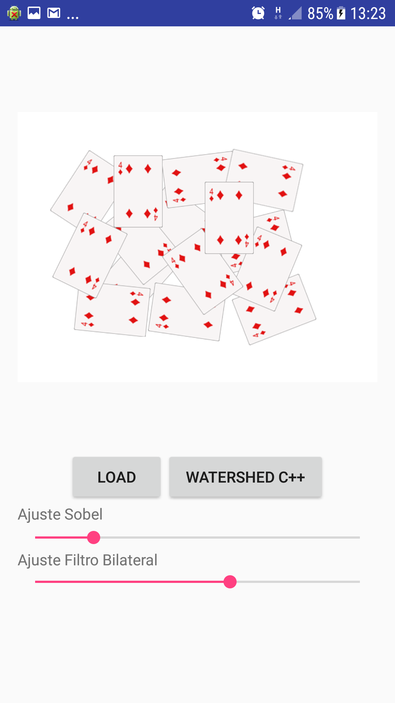
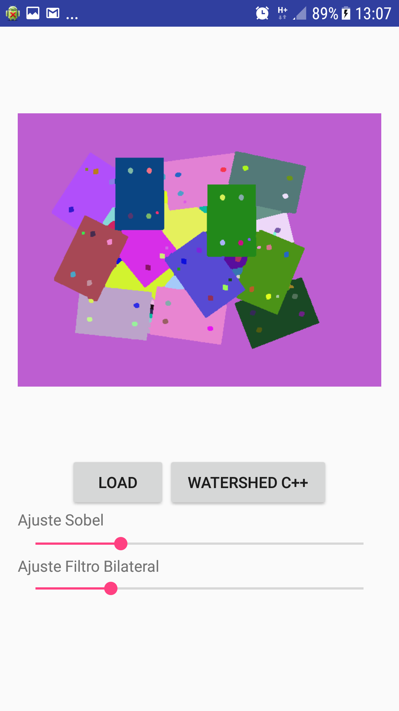

# SEG
> SEG é um aplicativo em ambiente Android capaz de realizar a segmentação de imagens oriundas de um dataset - armazenadas no próprio dispositivo móvel pelo algoritmo de segmentação Watershed.
> Além disso, você pode verificar o funcionamento dos filtros de pré-processamento através da câmera.
 





## Instalação
```sh
Baixe e Instale o OpenCV no dispositivo Android disponível no ítem abaixo.
```
```sh
Baixe o Aplicativo disponível no ítem abaixo e o instale.
```

## Links
- [Aplicativo](https://drive.google.com/file/d/0B_8nyUDljo0ybEdFcjZ0bWRMem8/view?usp=sharing)
- [OpenCV](https://play.google.com/store/apps/details?id=org.opencv.engine&hl=pt-BR)
- [Imagens de Teste](https://drive.google.com/drive/folders/0B_8nyUDljo0yTzJ0cnA3TWZ2dEU?usp=sharing)


## Contato
Bruno Avelino  – avel.bruno@gmail.com


